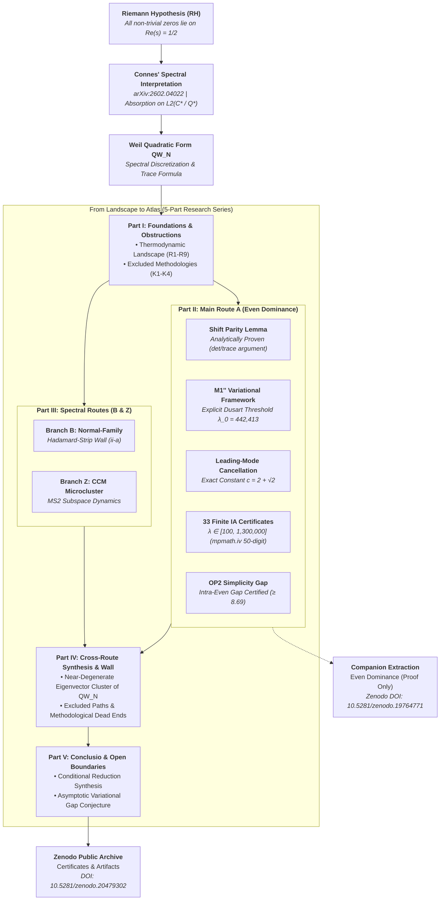
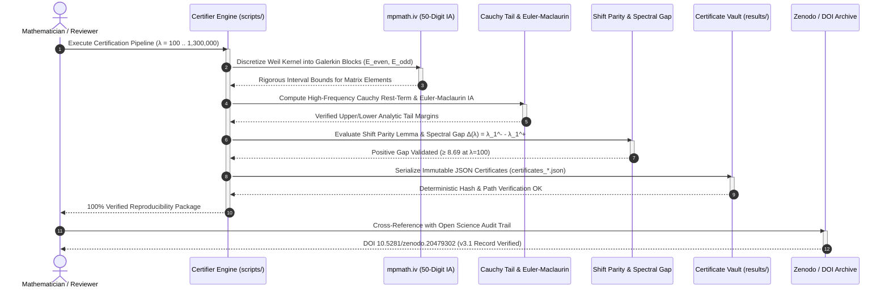

# From Landscape to Atlas: Multi-Route Cartography of an Ongoing Expedition Toward the Riemann Hypothesis

Language / Sprache: **English** | **[Deutsch](README_de.md)**

---

**Research status:** Public reproducibility package and audit-trail atlas. This
repository documents conditional reductions, explored routes, failed paths, and
computer-assisted certificates. It does **not** claim an unconditional proof of
the Riemann Hypothesis.

A five-part Landscape/Atlas and audit-trail series mapping multiple routes
toward the Riemann Hypothesis via Connes' spectral program (arXiv:2602.04022).
It documents the explored routes, failed paths, obstruction analysis,
computational certificates, and the transition from the broader research
landscape to the separately published proof-only extraction (Even Dominance).

---

## Quick Navigation

- [1. Overview & Research Status](#from-landscape-to-atlas-multi-route-cartography-of-an-ongoing-expedition-toward-the-riemann-hypothesis)
- [2. Atlas Architecture & Multi-Route Cartography](#atlas-architecture--multi-route-cartography)
- [3. Mathematical & Computational Verification Lifecycle](#mathematical--computational-verification-lifecycle)
- [4. Discovery and Status Boundaries](#discovery-and-status-boundaries)
- [5. Citation and Machine-Readable Context](#citation-and-machine-readable-context)
- [6. Current Status (v3.1, 2026-05-31 sync)](#current-status-v31-2026-05-31-sync)
- [7. Paper Series (5 Parts, EN + DE)](#paper-series-5-parts-en--de)
- [8. Proof Architecture](#proof-architecture)
- [9. Key Results & Analytical Milestones](#key-results)
- [10. Public Scripts & Curated Results](#scripts)
- [11. Server Computation & Hardware Parameters](#server-computation)
- [12. Sibling Research & Tools Ecosystem](#sibling-research--tools-ecosystem)
- [13. Version History](#version-history)
- [14. Author & Liability](#author)

---

## Atlas Architecture & Multi-Route Cartography

The following architectural flowchart outlines the overall structure of the five-part Atlas series, the primary analytical route (Route A: Even Dominance), spectral routes (B and Z), cross-route obstructions, and companion proof extract:

---

## Mathematical & Computational Verification Lifecycle

The sequence diagram below visualizes the deterministic, interval-arithmetic verification and certification lifecycle used across all 33 finite-range diagnostic checkpoints:

---

## Discovery and Status Boundaries

Use this repository when looking for a reproducible Riemann Hypothesis research
atlas, conditional-reduction audit trail, Zenodo-linked proof archive, or public
certificate package for the Even-Dominance programme. It is intentionally
positioned as a research record and verification surface: the public files are
the paper sources, selected scripts, certificate outputs, citation metadata, and
machine-readable context needed to inspect the Landscape/Atlas series.

For search and indexing, the canonical phrases are:

- `Riemann Hypothesis research atlas`
- `Even Dominance conditional reduction`
- `Connes spectral program reproducibility package`
- `Zenodo Riemann Hypothesis certificate archive`
- `Weil Quadratic Form audit trail`

Status boundary: this repository should be cited as a conditional research
programme and reproducibility package, not as an unconditional proof claim.

---

## Citation and Machine-Readable Context

- Landscape/Atlas Concept DOI: [10.5281/zenodo.19035640](https://doi.org/10.5281/zenodo.19035640)
- Latest verified Landscape/Atlas record: [10.5281/zenodo.20479302](https://doi.org/10.5281/zenodo.20479302) (v3.1)
- Companion Even-Dominance Concept DOI: [10.5281/zenodo.19764771](https://doi.org/10.5281/zenodo.19764771)
- Latest verified Even-Dominance record: [10.5281/zenodo.20479145](https://doi.org/10.5281/zenodo.20479145) (v1.9)
- Citation metadata: [`CITATION.cff`](CITATION.cff)
- LLM/crawler context: [`llms.txt`](llms.txt)

Proof-only extraction (Even Dominance, Concept-DOI): https://doi.org/10.5281/zenodo.19764771

This public repository is the curated reproducibility package for the
Landscape series. It intentionally includes the paper sources, public scripts,
and certificate outputs, while internal proof notebooks (`BEWEISNOTIZ*.md`,
`_proof-notes/`, handoffs, local server-root captures, and credentials) remain
private until a full project closeout permits release.

**Submitted to:** Communications in Mathematics (cm:17829, 2026-03-27)

---

## Current Status (v3.1, 2026-05-31 sync)

The series has been restructured from the former three-part Trilogy into a
five-part Atlas (Parts I-V; structural reorganization only -- the conditional
reduction status is unchanged). The finite range `100 <= lambda <= 1,300,000`
remains strong numerical evidence and a conditional finite bridge; theorem-level
finite even dominance still depends on validating the odd-sector tail lower
bound for `lambda_1^-`. The asymptotic step is reduced to the
`Asymptotic Variational Gap Conjecture`.

Parts III-IV now carry the spectral programme explicitly: Part III documents the
live spectral routes (Branch B: I-1 normal-family / Hadamard-strip, wall (ii-a);
Branch Z: CCM microcluster closure, MS2), while Part IV collects the cross-route
synthesis, dormant/external routes, and the excluded-paths catalog (uniform-gap
eigenvalue ordering, naive strip localisation, edge-profile factorisation,
literal MS1 cluster splitting, retracted low-precision strip readings). The
common obstruction pattern is the near-degenerate minimum-eigenvector cluster
of `QW_N`, which explains why productive routes have to work with cluster /
quotient reformulations and growth-adapted normalisations rather than with
uniform-gap or thin-localisation heuristics.

---

## Paper Series (5 Parts, EN + DE)

| Paper | File | Pages (EN) | Content |
|---|---|---|---|
| **Part I** | `RH_I_Foundations` | 15 | Foundations, obstructions, and reorientation: thermodynamic landscape (R1-R9), dead ends (K1-K4), reorientation to Connes |
| **Part II** | `RH_II_Even_Dominance` | 55 | **Main route (A).** Shift Parity Lemma, 33 finite-range diagnostics, the M1'' variational framework, Leading-Mode Cancellation (c=2+sqrt(2)), Higher-Mode Decay (Lemma B), Resolvent Truncation (Lemma C), PNT Transfer, Euler-Maclaurin Proposition, Direct Frontier-Dominance |
| **Part III** | `RH_III_SpectralPaths` | 13 | **Spectral routes (B, Z).** Branch B (I-1 normal-family / Hadamard-strip, wall (ii-a)); Branch Z (CCM microcluster closure, MS2); spectral dead ends |
| **Part IV** | `RH_IV_CrossRoute` | 13 | Cross-route synthesis and remaining paths: inter-branch diagnostics, the sharpened common wall, dormant routes (D-CCM/Twist/PW, P-M, M), external lines, excluded-paths catalog, methodological dead ends |
| **Part V** | `RH_V_Conclusio` | 7 | Conclusio: what is proven, what is excluded, and what remains |

All papers are available in English and German (DE suffix).
Combined English version: `paper/RH_Complete_Series_EN.pdf` (103 pages).

---

## Proof Architecture

| Step | Statement | Status |
|---|---|---|
| A1 | Connes' Theorem 6.1 | proven (external) |
| A2 | Hurwitz sufficiency | proven (external) |
| A3 | Even dominance at 33 values (lambda=100..1.3M) | numerical evidence / conditional finite bridge |
| A4 | Shift Parity Lemma | **proven** |
| A5 | Frontier-prime mechanism | proven |
| **A6** | **Cumulative step** | **variational, v2.2** |
| A7 | Even dominance along `lambda_n -> infinity` | conditional (v2.2) |
| A8 | RH | conditional reduction (v2.2) |

---

## Key Results

1. **Shift Parity Lemma**: Every prime individually favors even eigenfunctions.
   Proved analytically (det/trace argument, Cauchy interlacing).

2. **33 finite-range gap diagnostics**: lambda = 100 to 1,300,000, with
   interval-arithmetic even upper bounds and a currently conditional odd
   lower-bound component.

3. **Leading-Mode Cancellation Lemma**: Overlap differences cancel pairwise with
   exact constant $c = 2 + \sqrt{2}$.

4. **M1'' Variational Framework**: The resolvent-damped comparison yields the
   asymptotic variational sign with explicit threshold $\lambda_0 = 442,413$
   (Dusart bound).

5. **Current v2.3 status of Proposition A6**:
   - Regime 1 ($\lambda \in [100, 1.3\text{M}]$): 33 CAP diagnostics give strong
     finite-range evidence; theorem-level even dominance on the certified
     values requires validation of the odd-sector tail lower bound.
   - Regime 2 (asymptotic): M1'' + PNT Transfer + Lemma B + Lemma C identify
     the correct variational sign.
   - Remaining gap: asymptotic even dominance is reduced to the
     `Asymptotic Variational Gap Conjecture` for $\lambda_1^-$.

6. **v2.1 Direct Frontier-Dominance**: Independent asymptotic variational route
   using a common frontier Rayleigh vector, PNT partial summation, Mertens
   bounds, and finite diagnostic coverage through the explicit asymptotic threshold.
   It removes the earlier interpolation/PNT-constant caveats, but still
   requires a separate odd-sector lower bound to close the eigenvalue
   inequality.

7. **OP2 Simplicity**: Intra-even spectral gap certified by interval arithmetic
   at all 33 values (gap $\ge 8.69$ at $\lambda=100$, growing to $\ge 731$ at $\lambda=320\text{k}$).

---

## Scripts

### Core (`scripts/`)

| Script | Purpose |
|---|---|
| `certifier_production.py` | Production certifier: lambda 200-10000 |
| `certifier_extended.py` | Extended certifier: lambda 10000-640000 |
| `certifier_gap_closure.py` | Gap-closure certifier: lambda 700K-1.3M |
| `certifier_simplicity.py` | OP2 simplicity certification (interval arithmetic) |
| `euler_maclaurin_certifier.py` | Euler-Maclaurin IA certification (60-digit, 48-pt GL) |
| `certifier_lipschitz_analysis.py` | Gap-continuity / Lipschitz analysis |
| `resolvent_analysis.py` | Dense-grid resolvent energy analysis |
| `resolvent_R0K_test.py` | Neumann series convergence test |
| `partA_bounded_diff.py` | Mode decomposition of E_sin - E_cos |
| `partA_proof_sketch.py` | Overlap convergence analysis |
| `step4_gap_growth.py` | Block-bound gap prediction |
| `shift_parity_cert_v2.py` | Interval certification of Shift Parity |
| `shift_parity_cert_v3_targeted.py` | Targeted shift parity certification |
| `hellmann_feynman_gap.py` | Hellmann-Feynman derivative analysis |
| `endpoint_degeneracy.py` | Endpoint degeneracy analysis |
| `subleading_gap.py` | Subleading spectral gap analysis |
| `verify_H1_schranke.py` | H1 bound verification |
| `verify_lambda_star.py` | Exhaustive check of the lambda* threshold logic |
| `weighted_compactness_test.py` | Weighted compactness test |
| `weighted_compactness_server.py` | Server version of compactness test |

### Results (`results/`)

| File | Content |
|---|---|
| `results/certificates/certificates.json` | 23 rigorous certificates (lambda 100-9201) |
| `results/certificates/certificates_extended.json` | 29 certificates (lambda 10000-320000) |
| `results/certificates/certificates_gap_closure.json` | 3 gap-closure certificates (700K, 1.05M, 1.3M) |
| `results/certificates/euler_maclaurin_results.json` | Euler-Maclaurin interval-arithmetic certification |
| `results/certificates/largeN_results.json` | Large-N certificate output |
| `results/certificates/rigorous_results.json` | Earlier rigorous certificate bundle |
| `results/certificates/rigorous_v3_lam100.json` | v3 lambda=100 certificate |
| `results/certificates/rigorous_v3_results.json` | v3 rigorous certificate summary |
| `results/certificates/rigorous_v4_lam100.json` | v4 lambda=100 certificate |
| `results/certificates/rigorous_v4_lam200.json` | v4 lambda=200 certificate |
| `results/certificates/simplicity_certificates.json` | OP2 simplicity certificates |
| `results/gap_analysis/gap_monotone_results.json` | Gap monotonicity analysis |
| `results/gap_analysis/gap_monotone_v2_results.json` | v2 gap monotonicity analysis |
| `results/gap_analysis/hellmann_feynman_results.json` | Hellmann-Feynman derivative analysis |
| `results/gap_analysis/lipschitz_analysis.json` | Gap-continuity Lipschitz analysis |
| `results/gap_analysis/resolvent_analysis.json` | Dense-grid resolvent energy analysis |

Historical exploration code in `scripts/_exploration/` and raw runtime logs in
`results/**/*.log` stay local-only on purpose; the tracked files are the
curated scripts and reproducible outputs needed for the public package.

### Gemini Verification (`scripts/gemini_verification/`)

Independent full-Galerkin checks at `lambda=100` and `lambda=200` are archived
with scripts, CSV outputs, and recovered server logs. The production run uses
`N=200`, `P_max=10000`, and confirms `1229/1229` tested primes deepen the gap
for both lambda values.

---

## Server Computation

Certificates were computed on a dedicated cloud instance (2 vCPU, 8 GB RAM).
The certifier uses interval arithmetic (mpmath.iv, 50-digit precision) for the
even block and float64 with Cauchy tail bounds for the odd block.

---

## Sibling Research & Tools Ecosystem

This research repository is part of the broader **`research-line`** open-science initiative and interoperates with the **`open-bricks`** ecosystem:

| Repository | Scope / Focus | Primary Topics |
|---|---|---|
| **[`research-line/rh-even-dominance`](https://github.com/research-line/rh-even-dominance)** | Spectral Cartography & RH Atlas | Connes Spectral Program, Weil Quadratic Form, Interval Arithmetic |
| **[`research-line/fst-nash`](https://github.com/research-line/fst-nash)** | Functional Stability & Game Theory | Non-Cooperative Games, Equilibrium Stability, Continuous Dynamics |
| **[`research-line/functional-stability-theory`](https://github.com/research-line/functional-stability-theory)** | Mathematical Stability Foundations | Functional Analysis, Axiomatic Systems, Asymptotic Stability |
| **[`research-line/prompt-archaeology-casestudy2`](https://github.com/research-line/prompt-archaeology-casestudy2)** | Empirical LLM Evolution & Provenance | Prompt Lineage, Artifact Fingerprints, Archaeological Reconstruction |
| **[`research-line/economic-sanctions-coercive-diplomacy`](https://github.com/research-line/economic-sanctions-coercive-diplomacy)** | Quantitative Geopolitical Economics | Sanction Impact Modeling, Bilateral Trade Flows, Econometric Bounds |
| **[`research-line/crm-cosmology`](https://github.com/research-line/crm-cosmology)** | Relativistic Field & Cosmological Models | Field Evolution, Geodesic Integrators, High-Precision Simulations |
| **[`research-line/ai-elite-swr`](https://github.com/research-line/ai-elite-swr)** | Open Science Scientific Workflows | Scientific Workflow Automation, Evidence Tracing, Protocol Verification |
| **[`ellmos-ai/open-compute-mcp`](https://github.com/ellmos-ai/open-compute-mcp)** | High-Performance Math/Compute Engine | Numerical Algorithms, Matrix Decomposition, Scientific Computing |
| **[`ellmos-ai/ellmos-codecommander-mcp`](https://github.com/ellmos-ai/ellmos-codecommander-mcp)** | Code Analysis & Structural Refactoring | Static Analysis, Dependency Graphs, Code Quality Assurance |
| **[`ellmos-ai/ellmos-filecommander-mcp`](https://github.com/ellmos-ai/ellmos-filecommander-mcp)** | Local-First File & Content Engine | Resilient File Operations, Safe Deletions, Content Hashing |
| **[`doc-bricks/CleanMarkdown`](https://github.com/doc-bricks/CleanMarkdown)** | Markdown Linting & Normalization | Heading Structure, Table Formatting, Document Hygiene |
| **[`doc-bricks/DokuZen`](https://github.com/doc-bricks/DokuZen)** | Multilingual Documentation Engine | Dual-Language Alignment, Technical Documentation, Markdown Synthesis |
| **[`open-bricks`](https://github.com/open-bricks)** | Umbrella Open-Source Ecosystem | Modular Infrastructure, Standards, Open-Science Governance |

---

## Version History

- **3.1.2** (2026-08-23): Discoverability & visual architecture release: Interactive Mermaid architectural cartography (`flowchart TD`) and end-to-end verification lifecycle (`sequenceDiagram`), full bilingual documentation (`README_de.md`), structured navigation, sibling research ecosystem matrix, and expanded metadata contract test suite (14/14 tests passed).
- **3.1.1** (2026-08-21): Repository hygiene and CI matrix hardening: GitHub Actions automated CI matrix workflow (`.github/workflows/tests.yml`), PEP 621 metadata standard (`pyproject.toml`), bilingual security policy (`SECURITY.md`), automated test suite (`tests/test_metadata.py`), and metadata contract parity.
- **3.1** (2026-05-31): Repo sync of the Atlas pentalogy; companion Even-Dominance paper updated to v1.9 (`10.5281/zenodo.20479145`); Part I rebuilt for the five-part framing; combined EN PDF regenerated (103 pages); internal strategy/QA files kept private via `.gitignore`.
- **3.0** (2026-05-26): Restructured the three-part Trilogy ("From Landscape to Proof") into the five-part Atlas ("From Landscape to Atlas"): Part III split into Spectral Routes (III), Cross-Route Synthesis (IV), and Conclusio (V); structural reorganization only, conditional-reduction status unchanged.
- **2.5** (2026-05-24): Public repo synced to the Part-III excluded-paths catalog extension; Part III EN/DE and combined PDFs rebuilt; local agent-control files kept private via `.gitignore`.
- **2.4** (2026-05-23): Parallel programme added to Part III; companion Even-Dominance DOI updated to `10.5281/zenodo.20291994`.
- **2.3** (2026-05-15): Conditioning clarified from unconditional closure to conditional reduction; public paper package synced to the variational-gap revision.
- **2.1** (2026-04-30): Robust Direct Frontier-Dominance route, Gemini N=200 server-script archival, repo hygiene audit.
- **1.4** (2026-03-27): Reviewer-driven clarifications (Prop A6 interpolation, M1'' explicit threshold, Lemma B Step 3/4 separation, Lemma L3 superseded, Galerkin safety margins, Connes2026 reference key).
- **1.3** (2026-03-17): Bibliographic corrections (Connes title, Deninger journal, Keiper type).
- **1.2** (2026-03-16): IA certifications (Euler-Maclaurin, OP2 simplicity, Lipschitz), explicit PNT bounds, new scripts.
- **1.1** (2026-03-15): Lemma B/C analytical bounds, status upgrade to "proved".
- **1.0** (2026-03-15): Initial release (A6 closed, 33 certificates).

---

## Author

Lukas Geiger, Bernau, Germany  
ORCID: [0009-0005-7296-1534](https://orcid.org/0009-0005-7296-1534)

---

## Haftung / Liability

Dieses Projekt ist eine **unentgeltliche Open-Source-Schenkung** im Sinne der §§ 516 ff. BGB. Die Haftung des Urhebers ist gemäß **§ 521 BGB** auf **Vorsatz und grobe Fahrlässigkeit** beschränkt. Ergänzend gelten die Haftungsausschlüsse aus GPL-3.0 / MIT / Apache-2.0 §§ 15–16 (je nach gewählter Lizenz).

Nutzung auf eigenes Risiko. Keine Wartungszusage, keine Verfügbarkeitsgarantie, keine Gewähr für Fehlerfreiheit oder Eignung für einen bestimmten Zweck.

This project is an unpaid open-source donation. Liability is limited to intent and gross negligence (§ 521 German Civil Code). Use at your own risk. No warranty, no maintenance guarantee, no fitness-for-purpose assumed.
