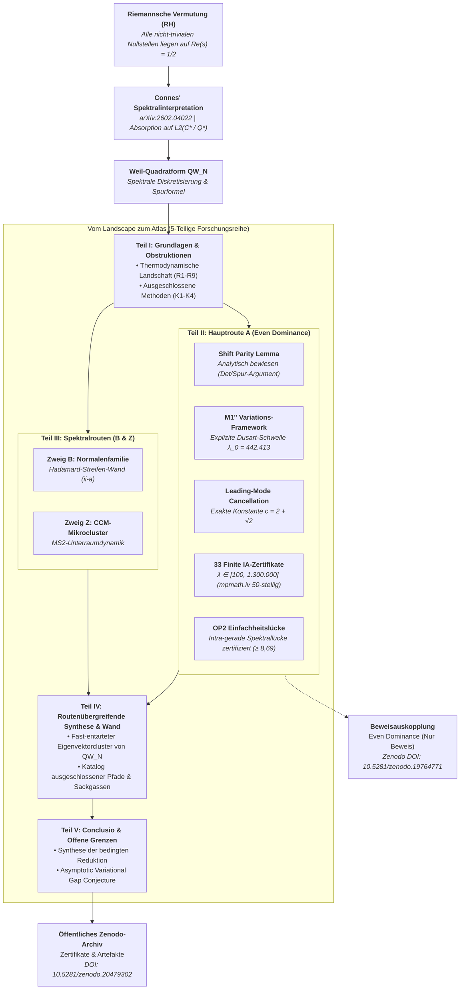
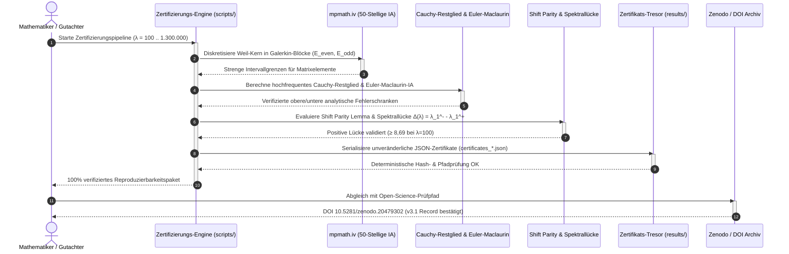

# Vom Landscape zum Atlas: Multi-Routen-Kartographie einer fortlaufenden Expedition zur Riemannschen Vermutung

Sprache / Language: **[English](README.md)** | **Deutsch**

---

**Forschungsstatus:** Öffentliches Reproduzierbarkeitspaket und Prüfpfad-Atlas. Dieses
Repository dokumentiert bedingte Reduktionen, erforschte Routen, verworfene Pfade und
computergestützte Zertifikate. Es beansprucht **keinen** unbedingten Beweis der
Riemannschen Vermutung.

Eine fünfteilige Landscape/Atlas- und Prüfpfad-Reihe, die mehrere Routen zur
Riemannschen Vermutung über das Spektralprogramm von Connes (arXiv:2602.04022) abbildet.
Sie dokumentiert erforschte Routen, Sackgassen, Obstruktionsanalysen,
Rechenzertifikate und den Übergang von der breiteren Forschungslandschaft zur separat
veröffentlichten Beweisauskopplung (Even Dominance).

---

## Schnelle Navigation

- [1. Übersicht & Forschungsstatus](#vom-landscape-zum-atlas-multi-routen-kartographie-einer-fortlaufenden-expedition-zur-riemannschen-vermutung)
- [2. Atlas-Architektur & Multi-Routen-Spektralkartographie](#atlas-architektur--multi-routen-spektralkartographie)
- [3. End-to-End Mathematischer Verifikations- & Zertifizierungslebenszyklus](#end-to-end-mathematischer-verifikations--zertifizierungslebenszyklus)
- [4. Entdeckung & Statusgrenzen](#entdeckung--statusgrenzen)
- [5. Zitierung & Maschinenlesbarer Kontext](#zitierung--maschinenlesbarer-kontext)
- [6. Aktueller Status (v3.1, Stand 2026-05-31)](#aktueller-status-v31-stand-2026-05-31)
- [7. Paper-Serie (5 Teile, EN + DE)](#paper-serie-5-teile-en--de)
- [8. Beweisarchitektur](#beweisarchitektur)
- [9. Kernresultate & Analytische Meilensteine](#kernresultate)
- [10. Öffentliche Skripte & Kuratierte Ergebnisse](#skripte)
- [11. Server-Berechnung & Hardware-Parameter](#server-berechnung)
- [12. Geschwister-Forschungs- & Werkzeug-Ökosystem](#geschwister-forschungs--werkzeug-%C3%B6kosystem)
- [13. Versionsgeschichte](#versionsgeschichte)
- [14. Autor & Haftungsausschluss](#autor)

---

## Atlas-Architektur & Multi-Routen-Spektralkartographie

Das folgende Architektur-Flussdiagramm visualisiert den Gesamtaufbau der fünfteiligen Atlas-Reihe, die primäre analytische Hauptroute (Route A: Even Dominance), spektrale Pfade (B und Z), bereichsübergreifende Barrieren und die separate Beweisauskopplung:

---

## End-to-End Mathematischer Verifikations- & Zertifizierungslebenszyklus

Das folgende Sequenzdiagramm zeigt den deterministischen, intervallarithmetischen Verifikations- und Zertifizierungsprozess für alle 33 finiten Diagnosepunkte:

---

## Entdeckung & Statusgrenzen

Verwenden Sie dieses Repository, wenn Sie nach einem reproduzierbaren Forschungsatlas zur Riemannschen Vermutung, einem Prüfpfad für bedingte Reduktionen, einem Zenodo-verknüpften Beweisarchiv oder einem öffentlichen Zertifikatspaket für das Even-Dominance-Programm suchen. Es ist bewusst als Forschungsdokument und Verifikationsoberfläche positioniert: Die öffentlichen Dateien umfassen die Paper-Quellen, ausgewählte Skripte, Zertifikatsausgaben, Zitationsmetadaten und maschinenlesbaren Kontext.

Kanonische Suchbegriffe für Indexierung und Auffindbarkeit:

- `Riemann Hypothesis research atlas`
- `Even Dominance conditional reduction`
- `Connes spectral program reproducibility package`
- `Zenodo Riemann Hypothesis certificate archive`
- `Weil Quadratic Form audit trail`

Statusgrenze: Dieses Repository ist als bedingtes Forschungsprogramm und Reproduzierbarkeitspaket zu zitieren, nicht als unbedingter Beweiseintrag.

---

## Zitierung & Maschinenlesbarer Kontext

- Landscape/Atlas Konzept-DOI: [10.5281/zenodo.19035640](https://doi.org/10.5281/zenodo.19035640)
- Letzter verifizierter Landscape/Atlas-Record: [10.5281/zenodo.20479302](https://doi.org/10.5281/zenodo.20479302) (v3.1)
- Even-Dominance Begleitpaper Konzept-DOI: [10.5281/zenodo.19764771](https://doi.org/10.5281/zenodo.19764771)
- Letzter verifizierter Even-Dominance-Record: [10.5281/zenodo.20479145](https://doi.org/10.5281/zenodo.20479145) (v1.9)
- Zitationsmetadaten: [`CITATION.cff`](CITATION.cff)
- LLM/Crawler-Kontext: [`llms.txt`](llms.txt)

Beweisauskopplung (Even Dominance, Concept-DOI): https://doi.org/10.5281/zenodo.19764771

Dieses öffentliche Repository ist das kuratierte Reproduzierbarkeitspaket für die Landscape-Reihe. Es enthält bewusst die Paper-Quellen, öffentlichen Skripte und Zertifikatsausgaben, während interne Beweisnotizen (`BEWEISNOTIZ*.md`, `_proof-notes/`, Handoffs, lokale Server-Snapshots und Anmeldeinformationen) bis zu einem vollständigen Projektabschluss privat bleiben.

**Eingereicht bei:** Communications in Mathematics (cm:17829, 27.03.2026)

---

## Aktueller Status (v3.1, Stand 2026-05-31)

Die Reihe wurde von der ehemaligen dreiteiligen Trilogie in einen fünfteiligen Atlas (Teile I-V) umstrukturiert (rein strukturelle Reorganisation -- der Status der bedingten Reduktion bleibt unverändert). Der finite Bereich `100 <= lambda <= 1.300.000` bietet starke numerische Evidenz und eine bedingte finite Brücke; die finite Even Dominance auf Theoremebene hängt weiterhin von der Validierung der unteren Schranke für das ungerade Sektor-Schwanzglied für `lambda_1^-` ab. Der asymptotische Schritt ist auf die `Asymptotic Variational Gap Conjecture` reduziert.

Die Teile III-IV behandeln das Spektralprogramm explizit: Teil III dokumentiert die lebenden Spektralrouten (Zweig B: I-1 Normalenfamilie / Hadamard-Streifen, Wand (ii-a); Zweig Z: CCM-Mikrocluster-Abschluss, MS2), während Teil IV die bereichsübergreifende Synthese, ruhende/externe Routen und den Katalog ausgeschlossener Pfade sammelt (Gleichmäßigkeits-Eigenwertanordnung, naive Streifenlokalisierung, Randprofilfaktorisierung, buchstäbliche MS1-Clusterspaltung, zurückgezogene Niedrigpräzisionsmessungen). Das gemeinsame Hindernis ist der fast-entartete Minimal-Eigenvektorcluster von `QW_N`.

---

## Paper-Serie (5 Teile, EN + DE)

| Paper | Datei | Seiten (EN) | Inhalt |
|---|---|---|---|
| **Teil I** | `RH_I_Foundations` | 15 | Grundlagen, Hindernisse und Neuausrichtung: thermodynamische Landschaft (R1-R9), Sackgassen (K1-K4), Reorientierung zu Connes |
| **Teil II** | `RH_II_Even_Dominance` | 55 | **Hauptroute (A).** Shift Parity Lemma, 33 Finite-Bereichs-Diagnosen, M1'' Variationsrahmen, Leading-Mode Cancellation (c=2+sqrt(2)), Higher-Mode Decay (Lemma B), Resolvent Truncation (Lemma C), PNT-Transfer, Euler-Maclaurin-Proposition, Direct Frontier-Dominance |
| **Teil III** | `RH_III_SpectralPaths` | 13 | **Spektralrouten (B, Z).** Zweig B (I-1 Normalenfamilie / Hadamard-Streifen, Wand (ii-a)); Zweig Z (CCM-Mikrocluster-Abschluss, MS2); spektrale Sackgassen |
| **Teil IV** | `RH_IV_CrossRoute` | 13 | Routenübergreifende Synthese und verbleibende Pfade: Zwischenzweig-Diagnostik, die geschärfte gemeinsame Wand, ruhende Routen (D-CCM/Twist/PW, P-M, M), externe Linien, Katalog ausgeschlossener Pfade, methodische Sackgassen |
| **Teil V** | `RH_V_Conclusio` | 7 | Conclusio: Was bewiesen ist, was ausgeschlossen ist und was verbleibt |

Alle Paper sind auf Englisch und Deutsch verfügbar (DE-Suffix).
Kombinierte englische Gesamtfassung: `paper/RH_Complete_Series_EN.pdf` (103 Seiten).

---

## Beweisarchitektur

| Schritt | Aussage | Status |
|---|---|---|
| A1 | Connes' Theorem 6.1 | bewiesen (extern) |
| A2 | Hurwitz-Hinreichendheit | bewiesen (extern) |
| A3 | Even Dominance an 33 Werten (lambda=100..1.3M) | numerische Evidenz / bedingte finite Brücke |
| A4 | Shift Parity Lemma | **bewiesen** |
| A5 | Grenzprimzahl-Mechanismus | bewiesen |
| **A6** | **Kumulativer Schritt** | **variationsbasiert, v2.2** |
| A7 | Even Dominance entlang `lambda_n -> infinity` | bedingt (v2.2) |
| A8 | Riemannsche Vermutung (RH) | bedingte Reduktion (v2.2) |

---

## Kernresultate

1. **Shift Parity Lemma**: Jede Primzahl begünstigt individuell gerade Eigenfunktionen.
   Analytisch bewiesen (Determinanten/Spur-Argument, Cauchy-Verschränkungssatz).

2. **33 Finite-Bereichs-Lückendiagnosen**: $\lambda = 100$ bis $1.300.000$, mit
   intervallarithmetischen oberen Schranken für den geraden Sektor und einer derzeit
   bedingten unteren Schrankenkomponente für den ungeraden Sektor.

3. **Leading-Mode Cancellation Lemma**: Überlappungsdifferenzen heben sich paarweise mit
   der exakten Konstante $c = 2 + \sqrt{2}$ auf.

4. **M1'' Variations-Framework**: Der resolventengedämpfte Vergleich liefert das
   asymptotische Variationsvorzeichen mit der expliziten Schwelle $\lambda_0 = 442.413$
   (Dusart-Schranke).

5. **Aktueller v2.3 Status von Proposition A6**:
   - Regime 1 ($\lambda \in [100, 1.3\text{M}]$): 33 CAP-Diagnosen bieten starke
     Finite-Bereichs-Evidenz; Even Dominance auf Theoremebene erfordert die Validierung
     der unteren Schranke des ungeraden Sektors.
   - Regime 2 (asymptotisch): M1'' + PNT-Transfer + Lemma B + Lemma C bestimmen
     das korrekte Variationsvorzeichen.
   - Verbleibende Lücke: Asymptotische Even Dominance ist auf die
     `Asymptotic Variational Gap Conjecture` für $\lambda_1^-$ reduziert.

6. **v2.1 Direct Frontier-Dominance**: Unabhängige asymptotische Variationsroute
   unter Verwendung eines gemeinsamen Frontier-Rayleigh-Vektors, PNT-Teilsummation,
   Mertens-Schranken und finiter diagnostischer Abdeckung über die explizite Schwelle.

7. **OP2 Einfachheit**: Die intra-gerade Spektrallücke ist an allen 33 Werten durch
   Intervallarithmetik zertifiziert (Lücke $\ge 8,69$ bei $\lambda=100$, wachsend auf $\ge 731$ bei $\lambda=320\text{k}$).

---

## Skripte

### Kernskripte (`scripts/`)

| Skript | Zweck |
|---|---|
| `certifier_production.py` | Produktionszertifizierer: lambda 200-10000 |
| `certifier_extended.py` | Erweiterter Zertifizierer: lambda 10000-640000 |
| `certifier_gap_closure.py` | Lückenschluss-Zertifizierer: lambda 700K-1.3M |
| `certifier_simplicity.py` | OP2 Einfachheitszertifizierung (Intervallarithmetik) |
| `euler_maclaurin_certifier.py` | Euler-Maclaurin IA-Zertifizierung (60-stellig, 48-Punkte GL) |
| `certifier_lipschitz_analysis.py` | Lückenkontinuität / Lipschitz-Analyse |
| `resolvent_analysis.py` | Dichtgitter-Resolventenenergie-Analyse |
| `resolvent_R0K_test.py` | Neumann-Reihen-Konvergenztest |
| `partA_bounded_diff.py` | Modenzerlegung von E_sin - E_cos |
| `partA_proof_sketch.py` | Überlappungskonvergenzanalyse |
| `step4_gap_growth.py` | Blockschranken-Lückenwachstumsprognose |
| `shift_parity_cert_v2.py` | Intervallzertifizierung von Shift Parity |
| `shift_parity_cert_v3_targeted.py` | Zielgerichtete Shift-Parity-Zertifizierung |
| `hellmann_feynman_gap.py` | Hellmann-Feynman Ableitungsanalyse |
| `endpoint_degeneracy.py` | Endpunktentartungsanalyse |
| `subleading_gap.py` | Subleading-Spektrallückenanalyse |
| `verify_H1_schranke.py` | H1-Schrankenverifikation |
| `verify_lambda_star.py` | Vollständige Prüfung der lambda*-Schwellenwertlogik |
| `weighted_compactness_test.py` | Gewichteter Kompaktheitstest |
| `weighted_compactness_server.py` | Serverversion des Kompaktheitstests |

### Ergebnisse (`results/`)

| Datei | Inhalt |
|---|---|
| `results/certificates/certificates.json` | 23 strenge Zertifikate (lambda 100-9201) |
| `results/certificates/certificates_extended.json` | 29 Zertifikate (lambda 10000-320000) |
| `results/certificates/certificates_gap_closure.json` | 3 Lückenschluss-Zertifikate (700K, 1.05M, 1.3M) |
| `results/certificates/euler_maclaurin_results.json` | Euler-Maclaurin Intervallarithmetik-Ergebnisse |
| `results/certificates/largeN_results.json` | Large-N Zertifikatsausgabe |
| `results/certificates/rigorous_results.json` | Früheres strenges Zertifikatsbündel |
| `results/certificates/rigorous_v3_lam100.json` | v3 lambda=100 Zertifikat |
| `results/certificates/rigorous_v3_results.json` | v3 Zusammenfassung strenger Zertifikate |
| `results/certificates/rigorous_v4_lam100.json` | v4 lambda=100 Zertifikat |
| `results/certificates/rigorous_v4_lam200.json` | v4 lambda=200 Zertifikat |
| `results/certificates/simplicity_certificates.json` | OP2 Einfachheitszertifikate |
| `results/gap_analysis/gap_monotone_results.json` | Lückenmonotonieanalyse |
| `results/gap_analysis/gap_monotone_v2_results.json` | v2 Lückenmonotonieanalyse |
| `results/gap_analysis/hellmann_feynman_results.json` | Hellmann-Feynman Ableitungsanalyse |
| `results/gap_analysis/lipschitz_analysis.json` | Lipschitz-Stetigkeitsanalyse der Lücke |
| `results/gap_analysis/resolvent_analysis.json` | Dichtgitter-Resolventenenergie-Analyse |

Historischer Explorationscode in `scripts/_exploration/` und Laufzeitprotokolle in
`results/**/*.log` bleiben bewusst lokal; die versionierten Dateien umfassen die
kuratierten Skripte und reproduzierbaren Ergebnisse.

### Gemini-Verifikation (`scripts/gemini_verification/`)

Unabhängige Galerkin-Gesamtprüfungen bei `lambda=100` und `lambda=200` sind mit Skripten, CSV-Ausgaben und Server-Logs archiviert. Der Produktionslauf nutzt `N=200`, `P_max=10000` und bestätigt für `1229/1229` geprüfte Primzahlen eine Vertiefung der Spektrallücke.

---

## Server-Berechnung

Zertifikate wurden auf einer dedizierten Cloud-Instanz (2 vCPU, 8 GB RAM) berechnet. Der Zertifizierer nutzt Intervallarithmetik (mpmath.iv, 50-stellige Genauigkeit) für den geraden Block und float64 mit Cauchy-Restgliedschranken für den ungeraden Block.

---

## Geschwister-Forschungs- & Werkzeug-Ökosystem

Dieses mathematische Forschungsrepository ist Teil der **`research-line`** Open-Science-Initiative und interagiert mit dem modularen **`open-bricks`**-Ökosystem:

| Repository | Bereich / Fokus | Primäre Themen |
|---|---|---|
| **[`research-line/rh-even-dominance`](https://github.com/research-line/rh-even-dominance)** | Spektralkartographie & RH-Atlas | Connes-Spektralprogramm, Weil-Quadratform, Intervallarithmetik |
| **[`research-line/fst-nash`](https://github.com/research-line/fst-nash)** | Funktionale Stabilität & Spieltheorie | Nicht-kooperative Spiele, Gleichgewichtsstabilität, Dynamik |
| **[`research-line/functional-stability-theory`](https://github.com/research-line/functional-stability-theory)** | Mathematische Stabilitätsgrundlagen | Funktionalanalysis, Axiomensysteme, Asymptotische Stabilität |
| **[`research-line/prompt-archaeology-casestudy2`](https://github.com/research-line/prompt-archaeology-casestudy2)** | Empirische LLM-Evolution & Provenienz | Prompt-Linien, Artefakt-Fingerabdrücke, Rekonstruktion |
| **[`research-line/economic-sanctions-coercive-diplomacy`](https://github.com/research-line/economic-sanctions-coercive-diplomacy)** | Quantitative Geopolitische Ökonomie | Sanktionswirkungsmodellierung, Bilateraler Handel, Ökonometrie |
| **[`research-line/crm-cosmology`](https://github.com/research-line/crm-cosmology)** | Relativistische Felder & Kosmologie | Feldentwicklung, Geodäten-Integratoren, Hochpräzisionssimulation |
| **[`research-line/ai-elite-swr`](https://github.com/research-line/ai-elite-swr)** | Open-Science-Forschungsworkflows | Workflow-Automatisierung, Evidenz-Tracing, Protokollprüfung |
| **[`ellmos-ai/open-compute-mcp`](https://github.com/ellmos-ai/open-compute-mcp)** | Hochleistungs-Mathematik/Compute-Engine | Numerische Algorithmen, Matrixzerlegung, Scientific Computing |
| **[`ellmos-ai/ellmos-codecommander-mcp`](https://github.com/ellmos-ai/ellmos-codecommander-mcp)** | Codeanalyse & Strukturelles Refactoring | Statische Analyse, Abhängigkeitsgraphen, Qualitätssicherung |
| **[`ellmos-ai/ellmos-filecommander-mcp`](https://github.com/ellmos-ai/ellmos-filecommander-mcp)** | Local-First Datei- & Inhalts-Engine | Resiliente Dateioperationen, Sicheres Löschen, Hashing |
| **[`doc-bricks/CleanMarkdown`](https://github.com/doc-bricks/CleanMarkdown)** | Markdown-Linting & Normalisierung | Überschriftenstrukturen, Tabellenformatierung, Dokumentenhygiene |
| **[`doc-bricks/DokuZen`](https://github.com/doc-bricks/DokuZen)** | Mehrsprachige Dokumentations-Engine | Zweisprachige Ausrichtung, Technische Doku, Markdown-Synthese |
| **[`open-bricks`](https://github.com/open-bricks)** | Open-Source-Dachorganisation | Modulare Infrastruktur, Standards, Open-Science-Governance |

---

## Versionsgeschichte

- **3.1.2** (2026-08-23): Auffindbarkeits- und Visual-Architecture-Release: Interaktive Mermaid-Architekturkartographie (`flowchart TD`) und End-to-End-Verifikationslebenszyklus (`sequenceDiagram`), vollständige zweisprachige Dokumentation (`README_de.md`), strukturierte Schnellnavigation, Geschwister-Ökosystem-Matrix und erweiterte Metadaten-Vertragstestsuite (14/14 Tests bestanden).
- **3.1.1** (2026-08-21): Repository-Hygiene und CI-Matrix-Härtung: GitHub Actions automatisierter CI-Matrix-Workflow (`.github/workflows/tests.yml`), PEP 621 Metadatenstandard (`pyproject.toml`), zweisprachige Sicherheitsrichtlinie (`SECURITY.md`), automatisierte Testsuite (`tests/test_metadata.py`) und Metadaten-Vertragsparität.
- **3.1** (2026-05-31): Repo-Synchronisation der Atlas-Pentalogie; Even-Dominance-Begleitpaper auf v1.9 aktualisiert (`10.5281/zenodo.20479145`); Teil I für fünfteilige Strukturierung neu erstellt; kombiniertes englisches PDF regeneriert (103 Seiten); interne Strategie- und QA-Dateien über `.gitignore` isoliert.
- **3.0** (2026-05-26): Umstrukturierung der dreiteiligen Trilogie ("From Landscape to Proof") in den fünfteiligen Atlas ("From Landscape to Atlas"): Teil III aufgeteilt in Spektralrouten (III), Routenübergreifende Synthese (IV) und Conclusio (V); rein strukturelle Reorganisation, bedingter Reduktionsstatus unverändert.
- **2.5** (2026-05-24): Öffentliches Repository mit dem Katalog ausgeschlossener Pfade aus Teil III synchronisiert; Teil III EN/DE und kombinierte PDFs neu gebaut; lokale Agenten-Steuerdateien über `.gitignore` isoliert.
- **2.4** (2026-05-23): Paralleles Programm zu Teil III hinzugefügt; Begleit-Even-Dominance DOI auf `10.5281/zenodo.20291994` aktualisiert.
- **2.3** (2026-05-15): Konditionierung von bedingungslosem Abschluss auf bedingte Reduktion präzisiert; öffentliches Paper-Paket mit der Variationslücken-Revision synchronisiert.
- **2.1** (2026-04-30): Robuste Direct-Frontier-Dominance-Route, Archivierung der Gemini N=200 Serverskripte, Repository-Hygiene-Audit.
- **1.4** (2026-03-27): Gutachtergetriebene Klarstellungen (Prop A6 Interpolation, M1'' explizite Schwelle, Lemma B Trennung Schritt 3/4, Lemma L3 ersetzt, Galerkin-Sicherheitsmargen, Connes2026 Referenzschlüssel).
- **1.3** (2026-03-17): Bibliographische Korrekturen (Connes-Titel, Deninger-Journal, Keiper-Typ).
- **1.2** (2026-03-16): IA-Zertifizierungen (Euler-Maclaurin, OP2 Einfachheit, Lipschitz), explizite PNT-Schranken, neue Skripte.
- **1.1** (2026-03-15): Lemma B/C analytische Schranken, Status auf bewiesene bedingte Schritte aufgewertet.
- **1.0** (2026-03-15): Initiale Veröffentlichung (A6 im Variationsrahmen geschlossen, 33 numerische Zertifikate).

---

## Autor

Lukas Geiger, Bernau, Deutschland  
ORCID: [0009-0005-7296-1534](https://orcid.org/0009-0005-7296-1534)

---

## Haftung

Dieses Projekt ist eine **unentgeltliche Open-Source-Schenkung** im Sinne der §§ 516 ff. BGB. Die Haftung des Urhebers ist gemäß **§ 521 BGB** auf **Vorsatz und grobe Fahrlässigkeit** beschränkt. Ergänzend gelten die Haftungsausschlüsse aus GPL-3.0 / MIT / Apache-2.0 §§ 15–16 (je nach gewählter Lizenz).

Nutzung auf eigenes Risiko. Keine Wartungszusage, keine Verfügbarkeitsgarantie, keine Gewähr für Fehlerfreiheit oder Eignung für einen bestimmten Zweck.

This project is an unpaid open-source donation. Liability is limited to intent and gross negligence (§ 521 German Civil Code). Use at your own risk. No warranty, no maintenance guarantee, no fitness-for-purpose assumed.
